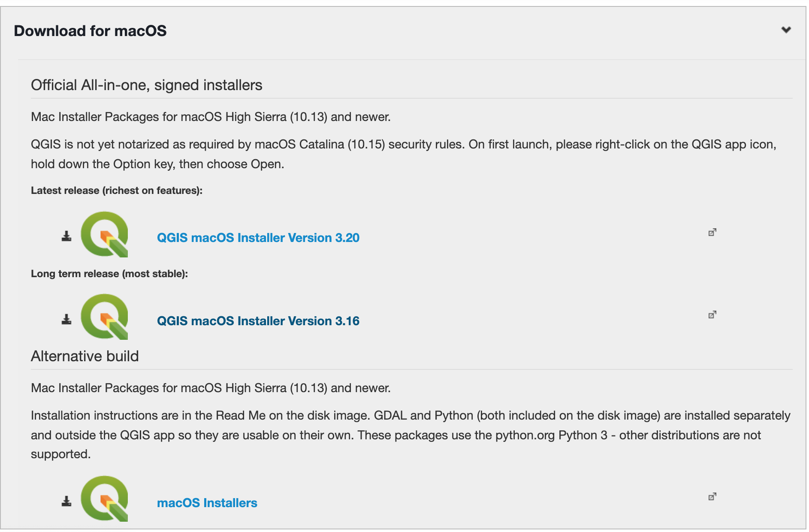
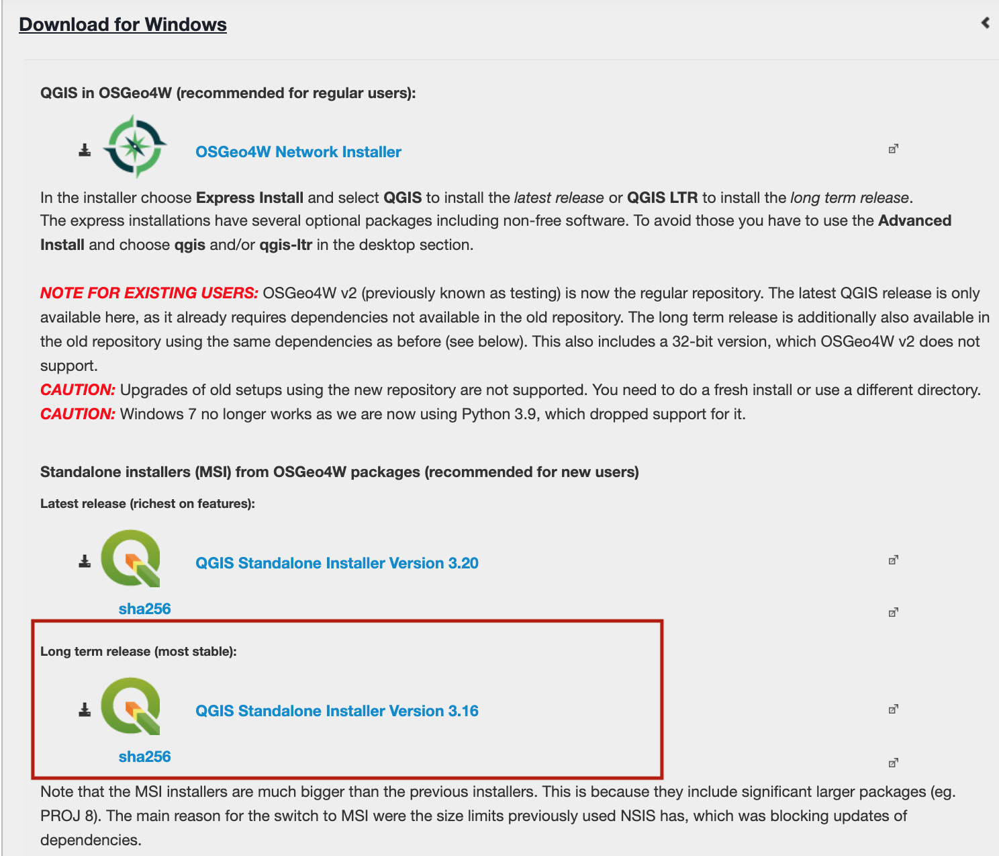
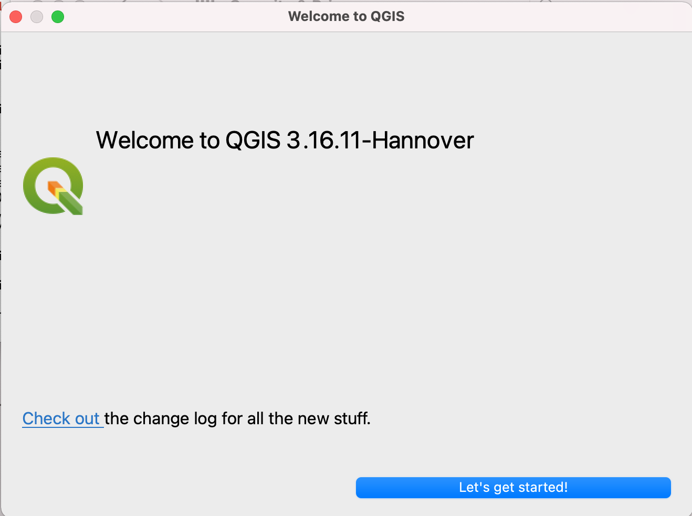
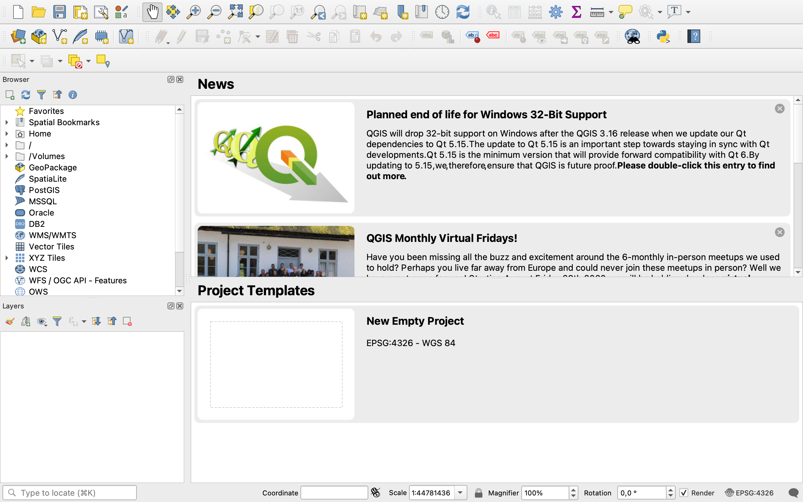
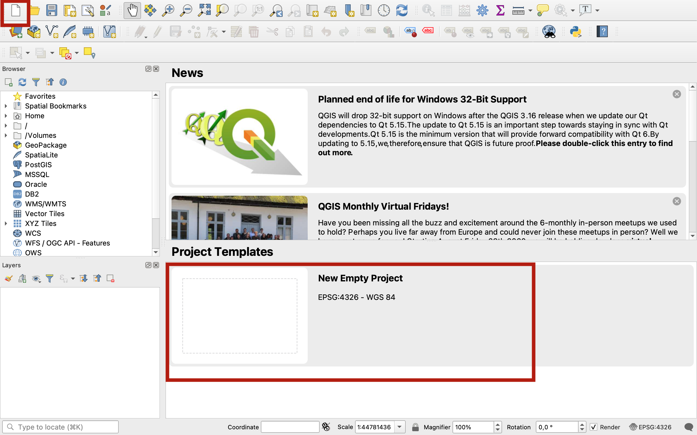

# Session 1: What is GIS?
**Introduction to GIS | Sciences Po Urban School, GETEC Masters | Fall semester 2021-2022**

Lecturer: Raphaëlle Roffo

.

## **I. Session 1 Overview** 

*[See Slides](https://github.com/raphaelleroffo/intro-to-gis/blob/main/Session1/Intro%20to%20GIS%20-%20session%201.pdf)*

- *Course overview and objectives*
- *GIS as a field of research and a tool*
- *Why is spatial special?*
- *Issues with 2D representations of the Earth surface: Coordinate Reference Systems and Projections*
- *Common use cases*
- *GIS and geospatial data science workflows*

.

## **II. Tutorial**

### Goals:

- Installing QGIS
- Exploring the QGIS console

.

### Downloading QGIS

Visit https://qgis.org/en/site/forusers/download.html

Download the long-term release (most stable) version for your OS. This is a stable and relatively bug-free version as opposed to the latest release in which new features were introduced but you may find some bugs.

**MacOS:**

If you own an old Mac you may need to download an older version of QGIS. If you are unable to download 3.16, try downloading one of the 2.18 releases from [this page](https://qgis.org/downloads/macOS/)

**Windows users:** download the QGIS Standalone installer, you won't need the OSGeo4W setup for your usage.

Once the installer is downloaded and launched, you can follow the steps and use the default options offered in each step. You're then ready to start mapping!

. 

### The QGIS GUI

Let's explore the QGIS Graphical User Interface (GUI).

.

#### 1. Opening a new project

To launch a new project from scratch, you can  click "new empty project" or the white page icon in the toolbar. You may also click `Project > New` in the top left menu dropdown.

#### 2. The map canvas

This is where your maps are displayed (in 2D). You can interact with it using the Map Navigation toolbar. You can pan across using the hand, zoom in and out using the magnifier glass, etc. We will get back to this next session when we start loading data into the project.

.
#### 3. The menu bar

This is the top layer of your interface, and it contains various dropdown menus:

- The `Project` menu allows you to access project files and export them, with tools to open an existing file, create a new one, close a project, save a project to various formats, export the map canvas as an image export with the `print layout` tools, etc.
- The `Edit` menu allows you to edit a layer's attributes or geometry, as well as to select features from a layer.
- The `View` menu
- The `Layer` menu allows you to interact with data sources (layers). You will mostly use it to load layers onto your map canvas.
- The `Settings` menu: you should not need to use user profiles or any of the options in this menu.
- The `Plugins` menu: it contains the `Manage and Install Plugins…` tool, which is basically a library in which you can pick new plugins you can add to QGIS. Those are open source tools that developers are sharing with the community. The `Python console` allows you to interact with QGIS using Python script. We will use it once this semester, to load basemaps!
- The `Vector` menu contains tools for dealing with vector data: geoprocessing tools, geometry tools, but also analysis, data management and research tools.
- The `Raster` menu contains tools for dealing with raster data. You will mostly use the raster calculator, conversion tools and analysis tools.
- The `Processing` menu contains shortcuts to the Processing toolbox, your processing history and other functions you won't need.

Other menus may be present if you have downloaded or enabled additional plugins (Mesh, Web, Database).
.
#### 4. The toolbars

toggling on and off
.

#### 5. The panels

Toggling on and off

**Browser**

**Layers**

**Processing toolbox**

.

#### 6. The status bar

.

### Documentation
The QGIS documentation is available at this address: https://qgis.org/en/docs/index.html

Please note:
1. This course is taught in English but some of you will have a version of QGIS installed that's in a different language. If you are trying to understand how a function translates into that language, at any time when navigating the documentation you can change the language of the page directly in the url (by replacing `/en/` by `/fr/` for French, or `/es/` for Spanish, `/zh-Hans/` for Mandarin Chinese etc.): For instance to go from English: https://docs.qgis.org/3.16/en/docs/user_manual/introduction/qgis_gui.html to French: https://docs.qgis.org/3.16/fr/docs/user_manual/introduction/qgis_gui.html

2. Similarly, you might have a version installed that is not 3.16 ; you can also edit the version directly in the URL to match the release you're using, by changing `/3.16/` . For instance from QGIS version 3.16 https://docs.qgis.org/3.16/en/docs/user_manual/introduction/qgis_gui.html to QGIS version 2.18 https://docs.qgis.org/2.18/en/docs/user_manual/introduction/qgis_gui.html 
