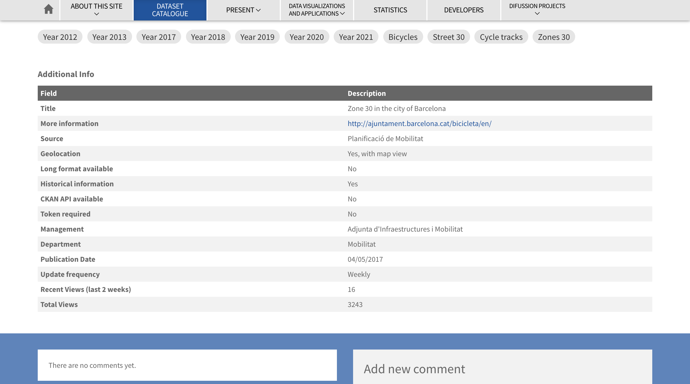
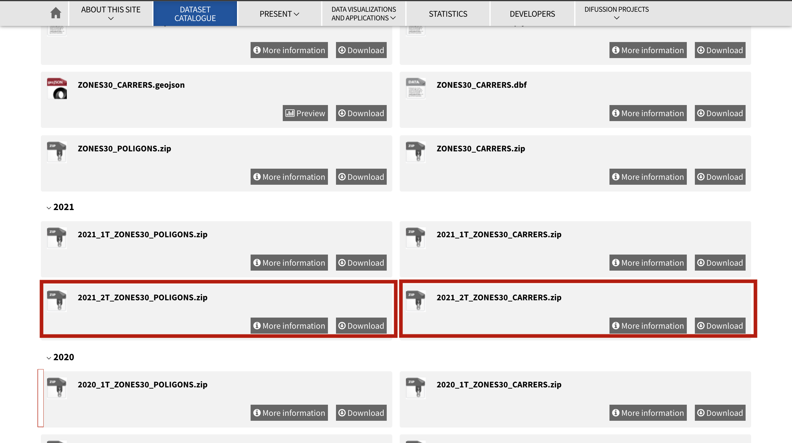
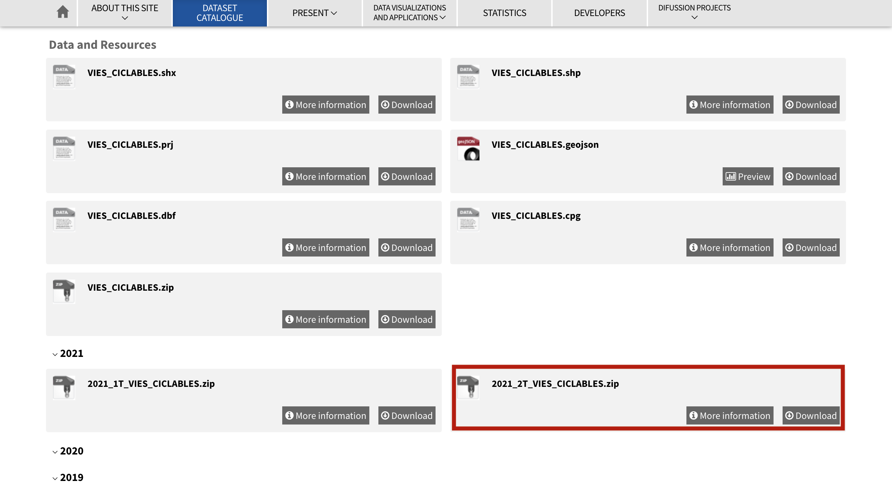
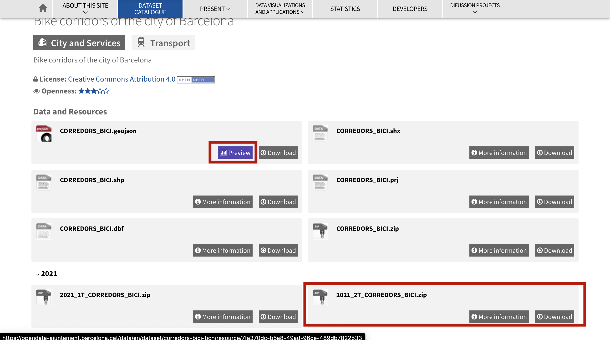
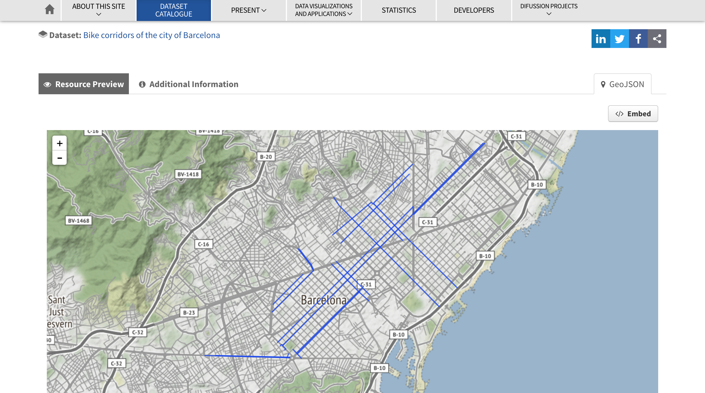
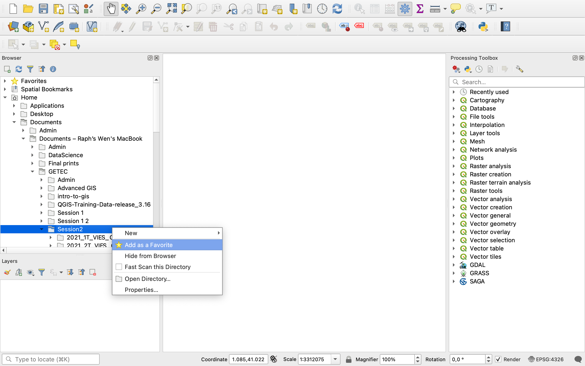
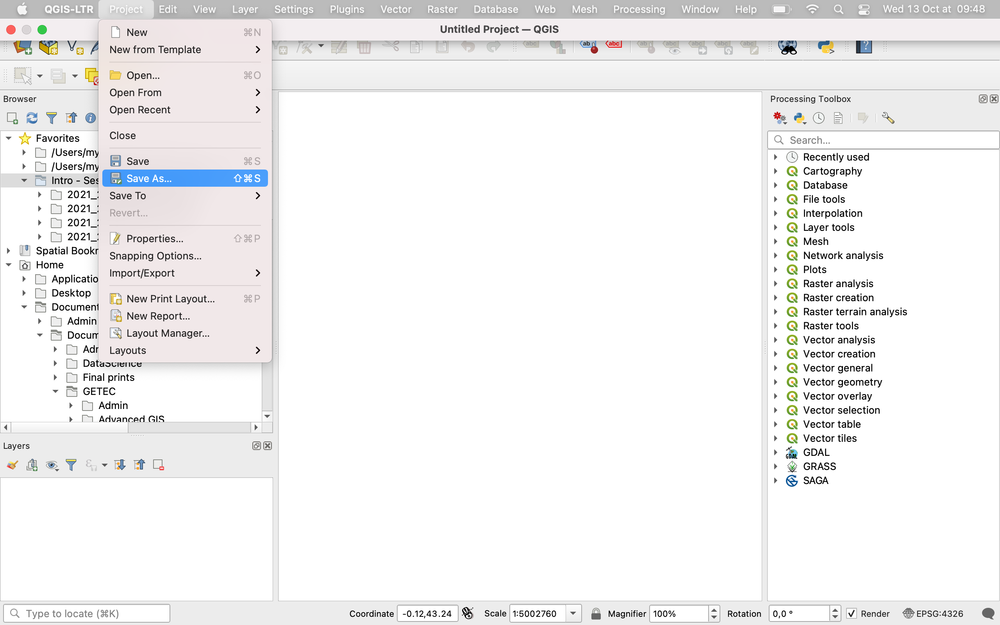
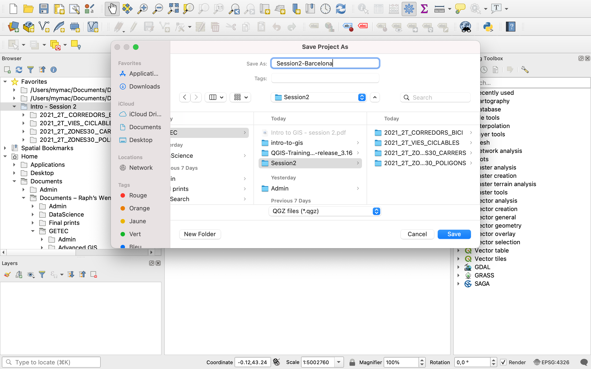

# Session 2: Sourcing and loading data into GIS

**Introduction to GIS | Sciences Po Urban School, GETEC Masters | Fall semester 2021-2022**

Lecturer: Raphaëlle Roffo

.

## **I. Session 2 Overview** 

*[See Slides](https://github.com/raphaelleroffo/intro-to-gis/blob/main/Session2/Intro%20to%20GIS%20-%20session%202.pdf)*

- *Last week recap*
- *Common GIS data formats*
- *Data sourcing*
- *Looking at data in kepler.gl*

.

## **II. Tutorial**

### Goals:

- Downloading data from an open data portal
- Setting up a QGIS project 
- Loading data into QGIS
- Saving vector data to a different format

.

### 1. Downloading data from the Barcelona open data portal

Today we'll look at the city of Barcelona and its green mobility infrastructure. Luckily, an open data portal is available for you to search for data. Go to https://opendata-ajuntament.barcelona.cat/data/en/dataset .

On the side panel, you can select the data formats you're interested in. Here, these could be SHP (shapefiles), GeoJSON and GPKG (geopackages). However there is a bug on the page as you can't select multiple formats at once ; if you select GeoJSON and SHP it will look for datasets that have both GeoJSON *and* SHP formats available. Instead, you have to do each format one by one. In this tutorial we'll stick to SHP as it's the most widely available format (23 datasets available) and in fact datasets available as GeoJSON are also available as SHP.

Now you see a list of various datasets. We will be interested in datasets related to cycling paths. Before you start downloading anything, make sure you create in your Documents a dedicated folder where you'll save all your downloads. You can call it `Session2`. Note that QGIS can get "cranky" if the folder sits on a Dropbox or some kind of cloud-based drive. Please choose a *local* location on your computer.

These are the datasets we will be working with:

- **Zones 30** (cars limited to 30km/h speed) https://opendata-ajuntament.barcelona.cat/data/en/dataset/zones30-carrers 
  
  

  *If you scroll all the way down, you 'll see a set of information; this is your metadata. It tells you about the characteristics of this dataset:*

  

  **/!\ Now, BE VERY CAREFUL! On most platforms, downloading a shapefile will lead to a download of a zip file that contain 4 files:  `*.shp`, `*.dbs`, `*.shx` and `*.prj`. However, on this data portal it's not the case and chosing to download the `*.shp` file will only download that single file. Note that this file would be unusable on its own! So make sure you download the `*.zip` file and keep everything in that file.**
  
  *We'll actually download both the 2021_2T_ZONES30_CARRERS Zip file, in which the Zone 30 streets are represented as lines, and the 2021_2T_ZONES30_POLIGONS Zip file, where they're grouped in areas (polygons):*
  
  
  .

- **Cycle paths** : https://opendata-ajuntament.barcelona.cat/data/en/dataset/vies-ciclables
  
  *Download the 2021_2T zip file:*
  

- **Bike corridors** https://opendata-ajuntament.barcelona.cat/data/en/dataset/corredors-bici-bcn
  
  *Download the zip file for T2.*
  
  
  
  *Note that when GeoJSON is available, you can preview the layer on a webmap:*
  
  

Once all of these files are downloaded, make sure you **unzip everything** before you move on to the next step. QGIS does not understand zip files and is not able to unzip them for you.

Now equipped with these 4 unzipped layers in your `Session2` folder, you are ready to open QGIS!

### 2. Setting up your QGIS project

Start a new blank project.
In your browser panel, navigate to the location of your `Session2` folder. Because it's usually hidden in successive folders, I like to add the location as favourite.

You can then rename the folder path to a simpler name such as "Intro Session 2". You can easily remove favourites from this right click menu.

Next, and before you start doign anything else, save your project file. Navigate to your `Session2` folder and save the file using the default extension: `*.qgz`.

### 3. Loading data into your project

### Exporting data / Saving in a different format

Let's imagine you want to export data in GeoJSON to play with it in kepler.gl 

### Documentation
The QGIS documentation is available at this address: https://qgis.org/en/docs/index.html

Please note:
1. This course is taught in English but some of you will have a version of QGIS installed that's in a different language. If you are trying to understand how a function translates into that language, at any time when navigating the documentation you can change the language of the page directly in the url (by replacing `/en/` by `/fr/` for French, or `/es/` for Spanish, `/zh-Hans/` for Mandarin Chinese etc.): For instance to go from English: https://docs.qgis.org/3.16/en/docs/user_manual/introduction/qgis_gui.html to French: https://docs.qgis.org/3.16/fr/docs/user_manual/introduction/qgis_gui.html

2. Similarly, you might have a version installed that is not 3.16 ; you can also edit the version directly in the URL to match the release you're using, by changing `/3.16/` . For instance from QGIS version 3.16 https://docs.qgis.org/3.16/en/docs/user_manual/introduction/qgis_gui.html to QGIS version 2.18 https://docs.qgis.org/2.18/en/docs/user_manual/introduction/qgis_gui.html 
