# Session 3: Working with vector data: the attribute table

**Introduction to GIS | Sciences Po Urban School, GETEC Masters | Fall semester 2021-2022**

Lecturer: Raphaëlle Roffo

.

## **I. Session 3 Overview** 

*[See Slides](https://github.com/raphaelleroffo/intro-to-gis/blob/main/Session3/Intro%20to%20GIS%20-%20session%203.pdf)*

- *Understanding the attribute table*
- *Querying data based on their attributes*
- *Joining layers: why and how?*

.
## **II. Tutorial**

### Goals:

- Load basemaps
- Access summary statistics about a field
- Understand the attribute table
- Explore how features and records are related
- Create a new field in your attribute table 
- Create a refactored copy of a field (change the data type)
- Create a query to select features by attribute
- Use queries to only display a subset of your layer's features
- Create a point layer from a `*.csv` file
- Run an attribute-based join

.

### 1. Setting up

**Open the project**

In the GitHub repo, go to the [Session3](https://github.com/raphaelleroffo/intro-to-gis/tree/main/Session3) folder and download the `Session3-London.gpkg` file. Save it in your documents (again, avoid saving in Dropbox/Cloud folders as it may get QGIS very cranky) under a `Session3` folder. 

Open QGIS, and open a blank document. In your `Browser` panel, navigate to this `Session3` folder. Click the arrow to see the content of the geopackage. Double click the `London` project file. Data for this project come from the London Datastore. This should automatically load these layers using the same symbology as in this screenshot. You may not have access to the basemap however. QGIS may give you an error message, which you can ignore for now.

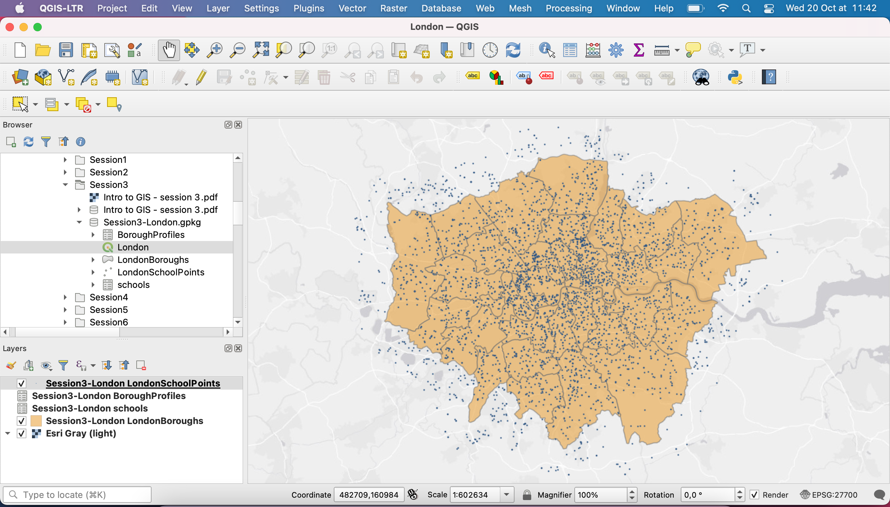

To load the basemap, we're going to use Python.

**Load basemaps**

One way to add basemaps in QGIS is to connect to a tile service from some online server. You can do that very quickly using the Python console!
Go to https://raw.githubusercontent.com/klakar/QGIS_resources/master/collections/Geosupportsystem/python/qgis_basemaps.py ; select and copy the entire text on that page (press Ctrl+A or ⌘+A, then Ctrl+C or ⌘+C).

Now go back to QGIS, and open the Python Console by clicking the Python icon in your toolbar, or going to your `Plugins` Menu > `Python Console`. This opens a new panel, usually located below your map canvas. Simply paste the script that you just copied (Ctrl + V or ⌘+V) and press enter. That's it!
Now if you look into your `Browser` panel and scroll down, you will see a `XYZ tiles` section. Click to open and you'll see a list of basemaps ready to use! You can close the Python console. Note that you only need to create this connection once, and the basemaps will now always be available in your QGIS console even when you work on a different project.

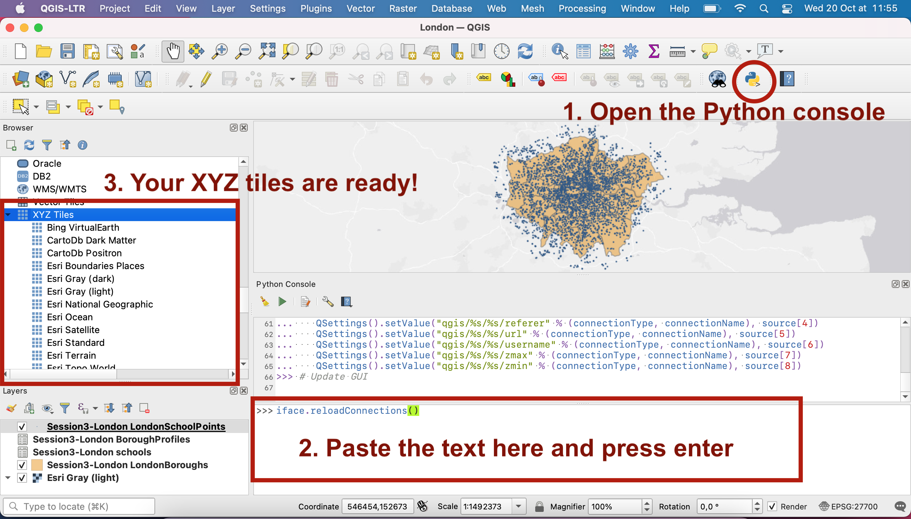

You can drag and drop the basemap you like onto your canvas. In this case I have used `Esri Gray (light)` because its design is quite simple and not overwhelming.

### 2. The statistics summary panel

As a means of exploring a layer, you may want to see some form of summary. Let's have a look at the LondonBoroughs layer. In your `Layers` panel, double-click  the LondonBoroughs layer or right-click > `Properties...`. This opens up a very important menu from which you can access a LOT of useful tools to deal with your layer. 

The first tab `Information` gives you some basic details about the layer: what's the path to the actual dataset on your computer, what format is it in (geopackage), the encoding, the type of layer (Polygon), the Coordinate Reference System (British NAtional Grid), the extent (maximum x and y coordinates, so basically the bounding box that contains your layer), the unit (meters) and the feature count (how many polygons=features are there in this layer, whcih is equivalent to asking how many rows=records in the attribute table).

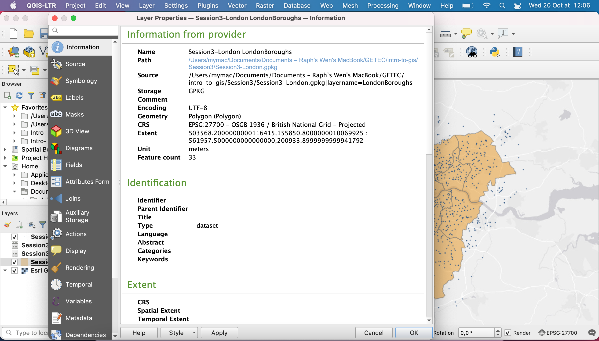

Close this menu and press Ctrl+6 or ⌘+6 , or navigate to your menu `View` > `Panels` > tick `Statistics`. A new menu appears. It's a bit squished in the bottom left corner so I will undock it (click the top of the panel, drag it towards your map canvas) and make it a bit larger. I then select the LondonBoroughs layer, and pick a field I'm interested in. For example, I'm curious to look at summary statistics about the average land size for the London boroughs. 

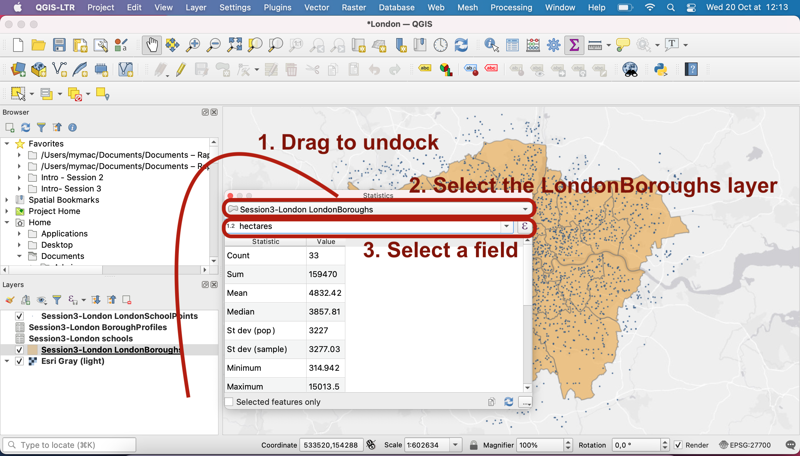

Indeed, we observe that there is huge variance in the size of these boroughs, between 315 hectares and 15,000 hectares. The median size is 3,857 hectares. 

Try and expore other summary statistics, for example for the LondonBoroughProfile table and look at the demographic fields.

### 3. The attribute table

As seen in the lecture, the attribute table contains **records** for all the **features** present in a vector layer. Let's see in practice what this means for the LondonBoroughs layer.

Click the LondonBoroughs layer in your `Layers` panel so its selected (blue). You have now access, in your toolbar, to the `Selection` tools. Use `Select feature(s)` and click on one polygon; it turns yellow. Now press your Ctrl/⌘ key or shift key to select a few polygons at once. The features that are added to your selection turn yellow.

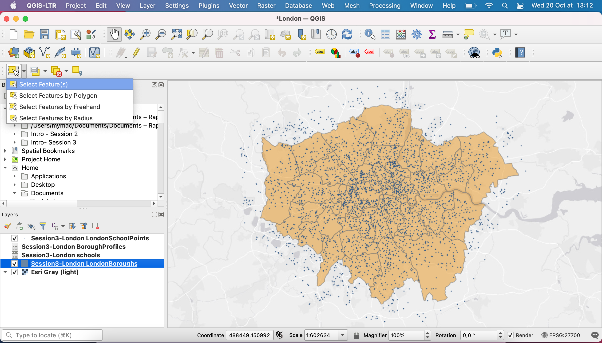

Now open your attribute table (right click on LondonBoroughs in your `Layers` panel > `Open attribute table`, or click the icon in your toolbar). You will notice that some rows are highlighted in blue. They are the recors linked to your feature selection. 

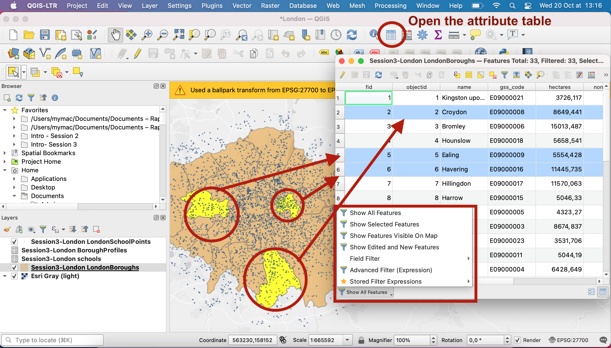

If you click on the bottom left filter, you can change the view; you could choose to filter the table to see only the selected features for instance, or you could create a custom filter using an expression, to display in your table only the rows that match certain conditions.

The table contains many fields. Note that the `gss_code` is a unique identifier; each borrow has a unique code in the format `E90000xx`. This is an important one for us because it will allow us to perform an attribute join later.

Note that in the Attribute table toolbar, you have access to selecion tools that are also present in your main interface toolbar. You can for instance inverse your selection.

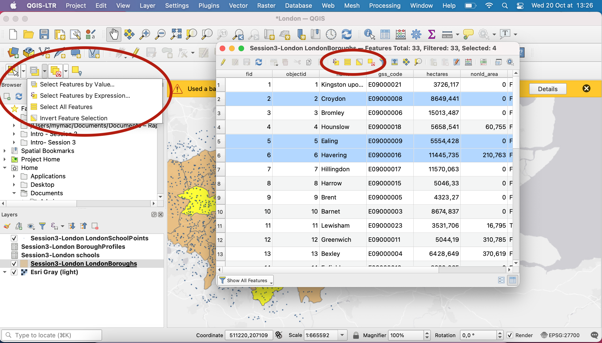

To learn more about the selection tool, read up [the documentation page](https://docs.qgis.org/3.16/en/docs/user_manual/introduction/general_tools.html#interacting-with-features) on the various tools available.

### 4. Identify features

As seen in the lecture, you can also use the `Identify` tool to click on features and retrieve the record linked to that feature. Make sure you have selected the layer you are interested in in your `Layers` panel.

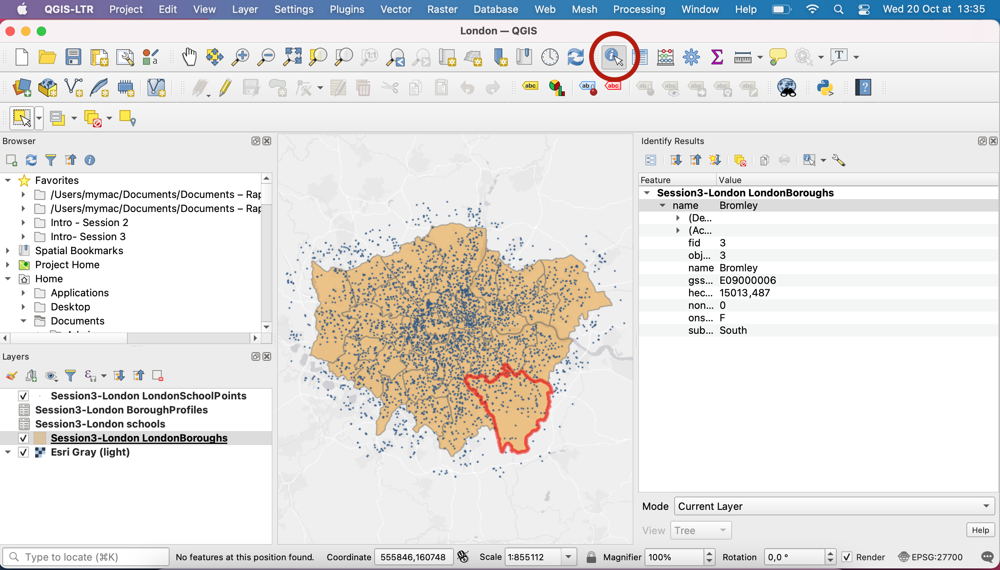

### 5. Create a point layer from a `*.csv` file

In this section, we will import a csv file that contains two fields of interest for us: a `longitude` and a `latitude` or `x` and `y`. Please note that an `Eastings` and `Northings` set of fields would be equally useful.

In QGIS, you can load spatial **and** non-spatial tables. Vector layers are spatial tables; each vector layer contains a geometry and an attribute table. But you can also load **delimited text files** in your QGIS projects (files such as `*.csv`, `*.txt`, `*.dat` or `*.wkt`). They may only contain text, or they may contain coordinates / geometries that you could want to utilize.

**If geometry is present in the csv**
In your geopackage you have a `schools` layer that contains coordinate fields. It is already loaded in our project as a simple table. As you can see, you can easily access the attribute table of this layer but there is no geometry attached. That's why in the `Layers` panel the icon is a table and you don't have the option to tick or untick that layer; it can't be added to teh map canvas anyway. 

Let's turn it into a point layer (the final result will be that `LondonSchoolPoints` layer that is present in the geopackage; as you can see the icon for that layer indicates that it is a **point** vector layer).

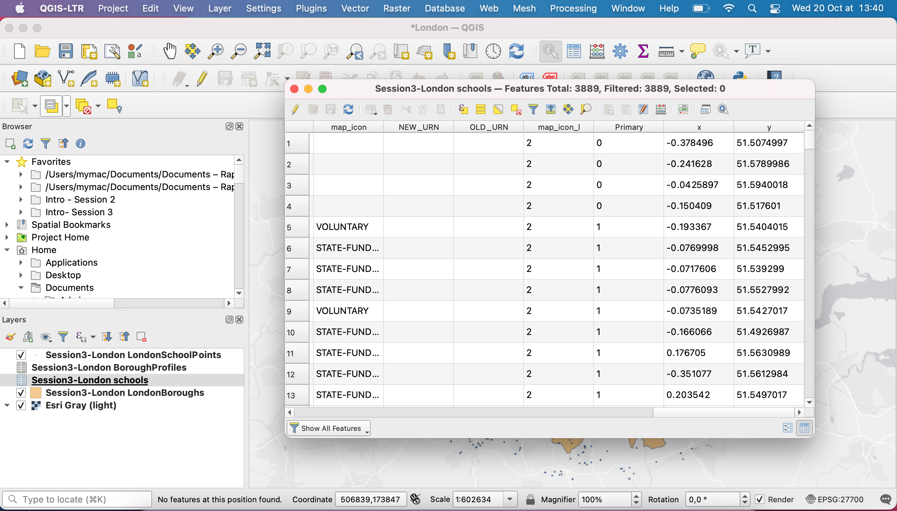

Go back to the GitHub repository and download the file `schools.csv` into your `Session3` folder. Back in QGIS, in your top menu, navigate to `Layer` > `Add layer` > `Add Delimited Text Layer...`.

Use the three dots to navigate to the `schools.csv` file location, and fill the parameters as in the screenshot below. Notice that QGIS has automatically detected the presence of `Eastings` and `Northings` fields and used them to populate the geometry fields. Be careful, this time we are working in the **British National Grid** - CRS (EPSG 27700)!

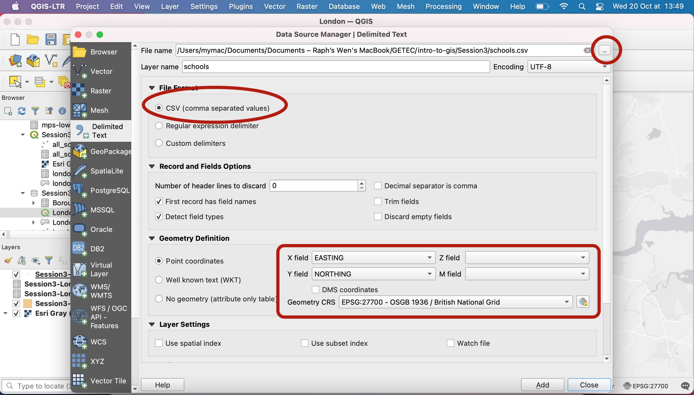

Click `Add` and close. You now have a point layer where each point is a school!

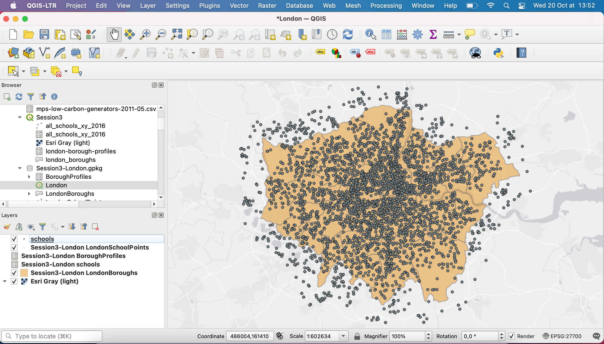

If you open the attribute table of that point layer, you will find the same information and the same number of rows as in the initial table.

**If your non-spatial table doesn't contain geometry**

If your non-spatial table does **not** contain geometry, then there are 2 options:
- One of the fields is a unique ID that you can join to an existing geometry layer: see next section.
- There is no field that you can in any way link to an existing geometry. There is nothing you can do and you can't use this data in your QGIS project.

### 6. Run an attribute-based join

Another non-spatial table is available in your geopackage; the `BoroughProfiles` table. I initially downloaded it as a csv file and it only contains tabular data. If you open the attribute table of this layer, you won't find any latitude/longitude or eastings/northings fields. However, you will notice the presence of a `Code` field. It turns out that this code is the same as the `gss_code` present in the `LondonBoroughs` polygon layer. When working on census data, national statistics offices will produce boundary files (vector layers) of each census unit, and will make sure to include a column with a unique ID for each polygon. Then, each table they produce will also refer to those unique census blocks by referring to this same unique ID. In this case, data is aggregated at the borough level and you have a code to link back each borough with the demographic data that was collected about this borough.

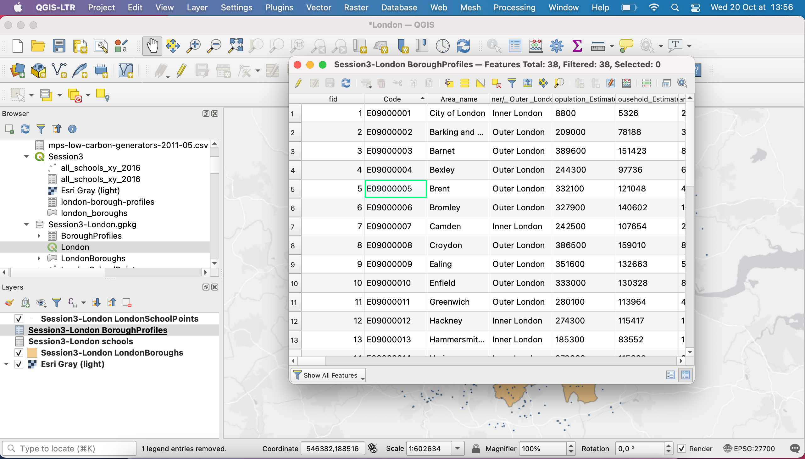

### 7. Create a query to select features by attribute

### 8. Use queries to only display a subset of your layer's features

You may use a very similar approach to only display a subset of your dataset's features, directly from the parameters menu of your layer. Double click your layer to open the `Layer properties`. Navigate to the `Source` tab. Below the `Provider Feature Filter`, you should find an empty section. This means no filter is currently applied. Under this white block, click  `Query builder` to create a new filter.

https://docs.qgis.org/3.16/en/docs/user_manual/working_with_vector/vector_properties.html#query-builder
The Query Builder dialog is accessible through the eponym button at the bottom of the Source tab in the Layer Properties dialog, under the Provider feature filter group.

The Query Builder provides an interface that allows you to define a subset of the features in the layer using a SQL-like WHERE clause and to display the result in the main window. As long as the query is active, only the features corresponding to its result are available in the project.

### 9. Create a new field in the attribute table

Now imagine that you 
**Fields Property** https://docs.qgis.org/3.16/en/docs/user_manual/working_with_vector/vector_properties.html#fields-properties 

Double click on a layer to open the `Layer properties`. Navigate to the `Fields` tab. This tab gives us information on the fields present in the attribute table. If a join exists, it is also displayed here in a different colour.

From this menu, you are able to edit the structure of your attribute table. If you toggle the Editing mode, you get access to the `New field` and `Delete field` buttons

### 10. Create a refactored copy of a field (change the data type)

In some instances, you will need a field to be stored in a certain data format (string, float, integer). For example, if you are trying to join two tables based on a common field, this field will need to be of data type `string`. It may be a serial number for example, or a code made of digits. In this case, it may be stored as an `integer`. In this case, you will need to "translate" your data in the right data type before you can go any further.

