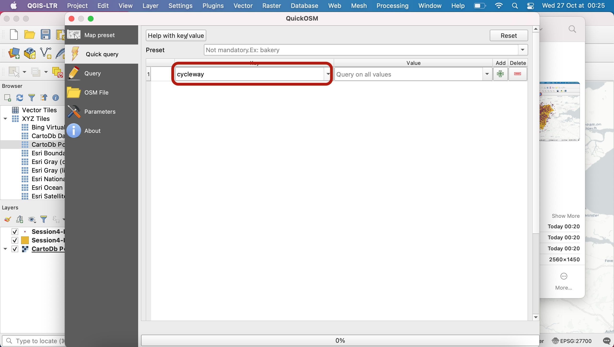
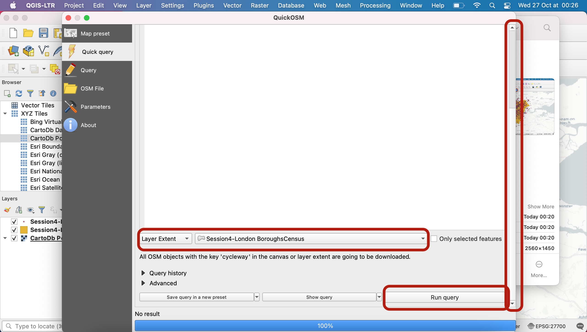
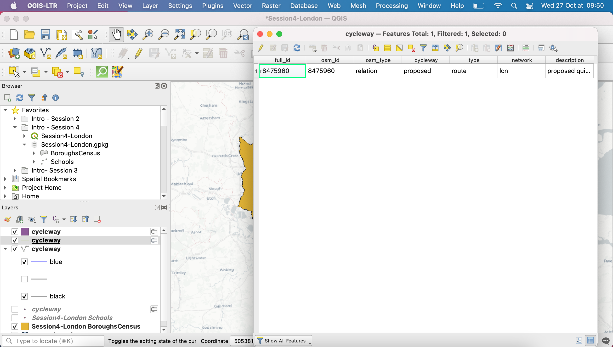
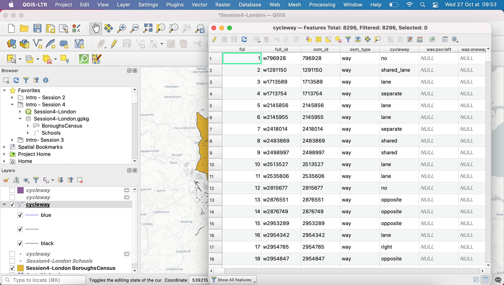
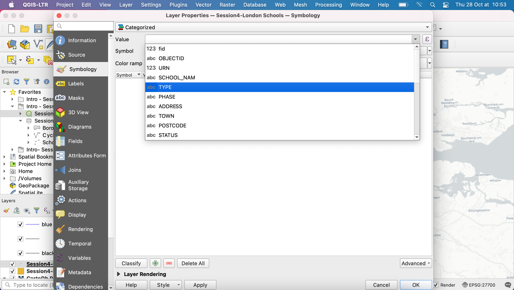
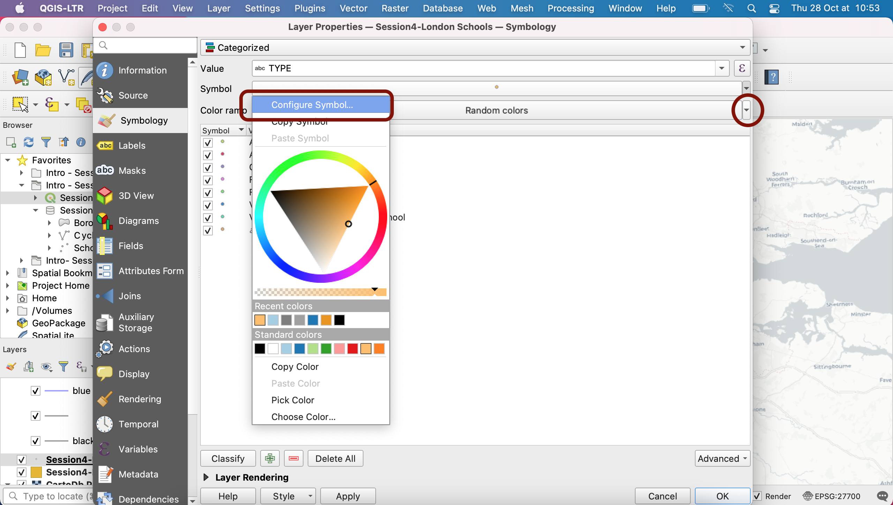

# Session 4: Cartographic design

**Introduction to GIS | Sciences Po Urban School, GETEC Masters | Fall semester 2021-2022**

Lecturer: Raphaëlle Roffo

.

## **I. Session 4 Overview** 

*[See Slides](https://github.com/raphaelleroffo/intro-to-gis/blob/main/Session4/Intro%20to%20GIS%20-%20session%204.pdf)*

- *Cartographic design principles*
- *Accessibility*
- *Elements of a Map Layout*
- *Choropleths*
- *Choosing the right class breaks (number, method) and colour palette*

.
## **II. Tutorial**

### Goals:

- Loading data from Open Street Map
- Vector symbology
- Building a Choropleth
- Exporting a map: setting up a layout and adding map elements (north arrow, scale bar, legend, title etc.) 

.

### 1. Setting up

Download the `Session4-exercise` geopackage from GitHub. It contains the same London data as last week. Drag and drop the `BoroughsCensus` layer and the `Schools` layer onto your canvas. Make sure the CRS is set to `EPSG:27700`.

Pick a basemap of your choice from the `XYZ Tiles` section of your `Browser` panel. I'll be using `CartoDb Positron`.

### 2. Loading OSM layer

Now, we have decided we want to look at cycling lanes in the Greater London Metropolitan Area. We will be using crowdsourced data from [OpenStreetMap](https://www.openstreetmap.org/about). In order to access this data, we will use the QGIS `QuickOSM` plugin. You can access it through your top menu: `Plugins` > `Manage and Install Plugins...`. Search "quickosm" in your searchbar, install the plugin and close this window.

Now, to access the plugin, you can either click the icon that appeared in your toolbar, or access it via your top menu: `Vector` > `QuickOSM`.

This plugin basically enables you to query the (very large!) OpenStreetMap SQL database and load layers of your choice onto your map canvas. You can learn more about what you're querying [at this address](https://docs.3liz.org/QuickOSM/). Today, we will load all the `cycleway` features and we will see later what kind of filtering we might want to do using the values (are they one-way, shared lanes, etc), so leave the `Value` box blank for now.

Scroll down in the menu (maybe use the vertical scroll bar) and select the spatial extent of your Boroughs layer as the query extent. It means you only want to download cycleways that are within the Greater London boundaries. Press `Run query`.

After a few seconds to a few minutes, you shold get a success message, a 100% blue prorgess bar, and notice that 4 new layers were loaded onto your canvas. Great! You can now close the query window.

Note that QuickOSM is a very powerful way for you to get access to feature geometries! However attributes can sometimes be a bit messy or lack consistency (same feature types might be given different names), which may make them tedious to navigate.

Let's have a look at those layers. For cycling lane you would expect to work with lines, however QuickOSM also loaded a point layer. If you double-click the attribute table, you will notice that those points are actually *nodes* and don't contain especially useful attributes. We can't really use this layer to do anything so we will just remove it from our project.

The polygon layer also doesn't make much sense and only contains a single record.

 The layer with a single line in it will also not be useful to us. 
 
 

 We will also remove those two layers from our project, and only keep the polyline layer that contains 8296 features.

**Scratch layer Warning!** 

When you create a new layer using a geoprocessing tool (or in this case the QuickOSM plugin), QGIS will produce a temporary layer, aka "scratch layer". This layer only exists for you in _this_ open session of QGIS and **is not saved anywhere on your computer**. This means unless you do something about it, the layer will be gone next time you reopen this project. Make sure you avoid this rookie mistake by checking that none of your layers display the little hairy box sign. If they do (like in this case, the layers you just queries from OSM) double click and save the layers you want to keep into your project geopackage (give each layer a meaningful name) or as a new shapefile in your project folder. The little hairy box icon will disappear after you save the layer somewhere on your computer.

In this case, simply save the polyline cycleway layer, and remove the three others from your Layers section if you haven't already.

Now that you've saved your cycleway layer (if you refresh your browser, it should appear in your geopackage), let's move on to the symbology step.

### 3. Vector symbology

**3.1. Accessing symbology settings**

For any layer, you can double click to open its `Layer properties` menu and navigate to the `Symbology` tab to access all the settings. Start with your `Schools` point layer. In the top dropdown menu you're given a few options.

These 5 options are common to points, lines and polygons alike (points and polygons have a few additional symbology options of their own):

- **No symbols** = nothing is displayed on the map
- **Single symbol** = all features are displayed the same way
- **Categorized** = features symbols depend on the value of one of their **categorical** attributes (e.g. which type of school, which type of cycling lane)
- **Graduated** = features symbols depend on the value of one of their **numerical** attributes (e.g.length of the cycling lane, population count in a borough, etc)
- **Rule-based** = you can define more advanced nuances using filters and expressions. For instance you could create 3 rules: 1)if a cycling lane is longer than 2km **and** in a separated lane then apply a certain symbology to it, otherwise 2) if it is between 500m and 2km and on a one-way road applly another symbology, and 3) don't display the rest.

**3.2 Point symbology**

Using the single symbol, try to change the opacity, size and colour of your points. Note you can also use presets in the section below.

Now click on the `Simple Marker` to access further customization options. A few useful ones include the size and colour of stroke, and the shape of your marker. 

Note that you can even use common logos or import your own SVG or raster symbols to use as markers - for instance here under `Symbol layer type` select `SVG marker` , scroll down and you have access to a large array of logos, including this school logo. You can try it out, notice that it is not the right choice in this case and then please reverse back to a simple marker symbology of size 2mm and grey colour.

Now that you know more about the symbology customization, let's move on to something more useful for understanding our data. We decide we actually only want to work on primary schools that are currently operational (not closed, not opening in the future). To do so, we want to edit the definition query of our layer so that we only display the open primary school features. Navigate to your `Source` tab, and click `Query builder`. Find out what values are available for different fields. For instance select `STATUS` and click on Sample `All` values. You can double click a field, an operator and a value to directly add them into your expression. Use `Test` to see if your expression has any syntax error.
Write the query that keeps primary schools that are still open, click OK to close this window, click `Apply` in the `Source` tab and go back to your `Symbology` tab.

We are now interested in displaying the different types of schools in different colours, to see if there is any geographical pattern as to where certain types of schools can be found. To do so, we will use a `Categorized` symbology and pick `TYPE` as our value. 

Click `Classify` to load the Types values into your legend. Note that you can update your base symbol (click on the `Symbol` dropdown arrow then `Configure symbol`) and choose a specific colour ramp from the many available. Because we are using categorical variables here, we prefer to avoid using a sequential palette which would imply some form of order among the values (there is no order here, they're just three different values). You can also edit each symbol one by one by clicking on them directly.

You can explore the many options available to you in the colour ramp (including shuffling the colours currently assigned to your values, creating your own random colour palette or editing existing ones).

To go further, read more about the symbology on the [Documentation](https://docs.qgis.org/3.16/en/docs/training_manual/basic_map/symbology.html)

You can also play with scale dependent rendering; using this feature, you control the appearance of your layer at different scales (for instance, you might want some layers to stop being visible when you zoom out of the area to avoid clutter)
https://docs.qgis.org/3.16/en/docs/user_manual/introduction/general_tools.html#scale-dependent-rendering

Spatial bookmarks
https://docs.qgis.org/3.16/en/docs/user_manual/introduction/general_tools.html#spatial-bookmarks 

Note: the colour selector can be a useful
https://docs.qgis.org/3.16/en/docs/user_manual/introduction/general_tools.html#color-selector 