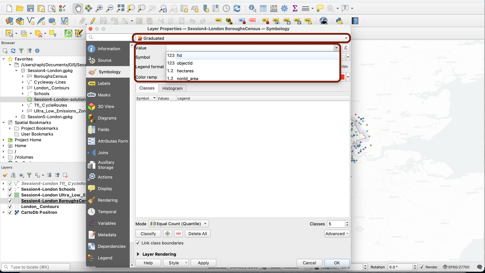
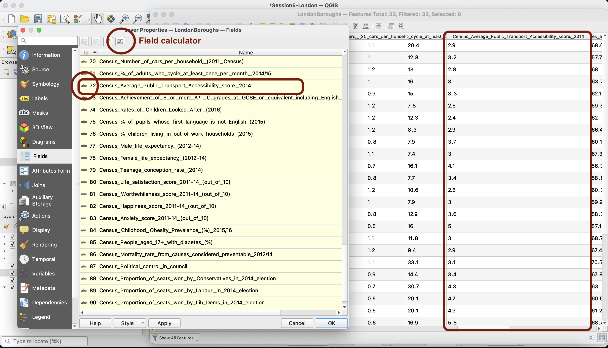
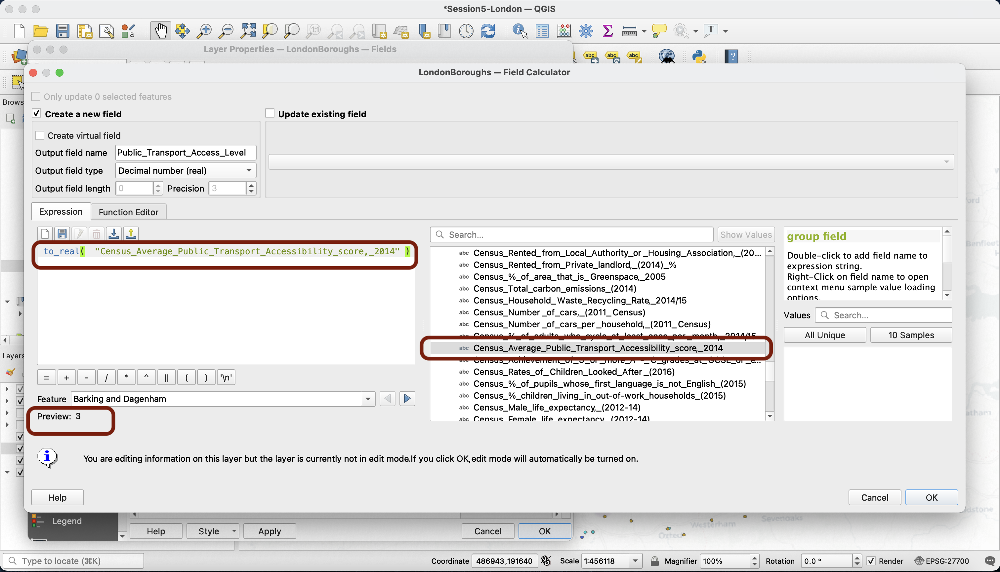
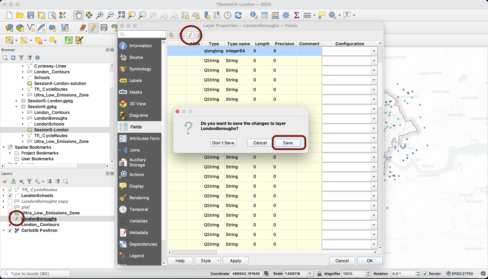
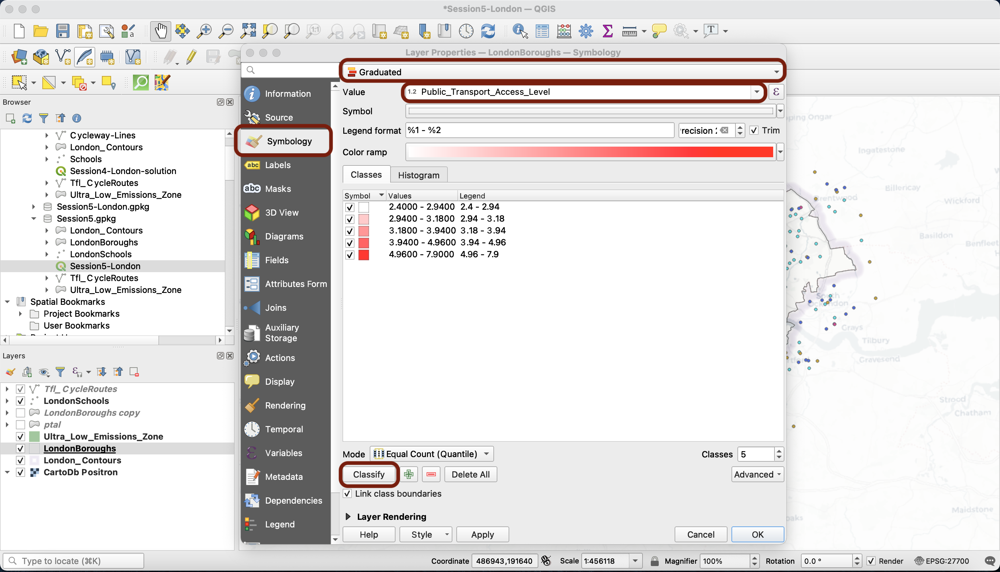
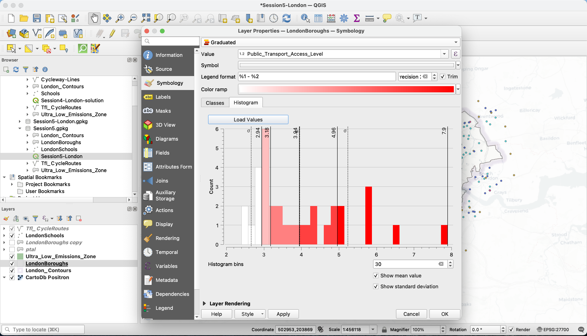
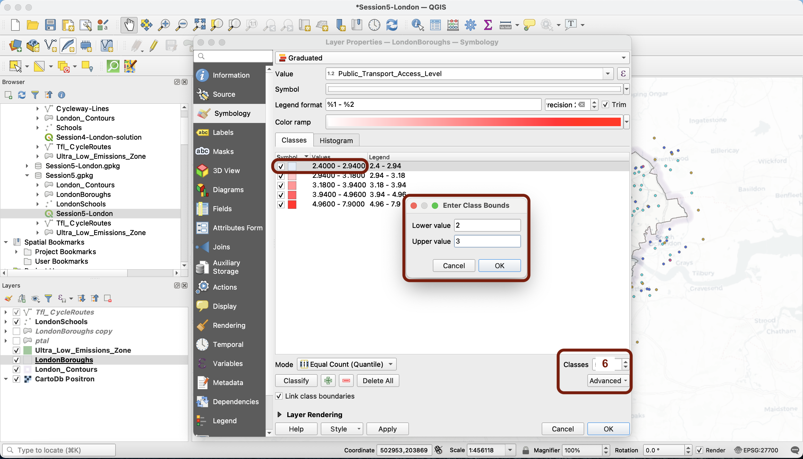
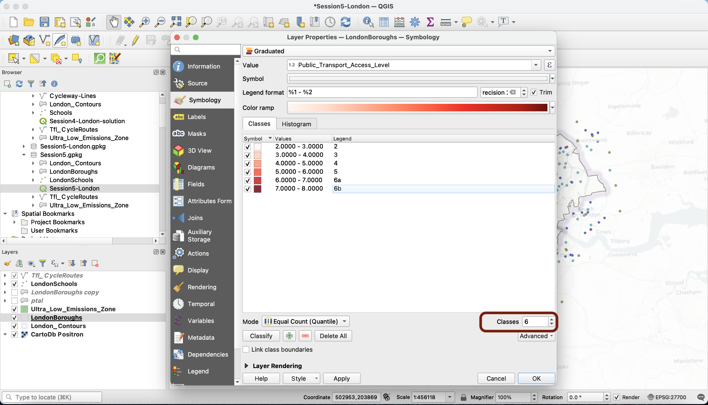
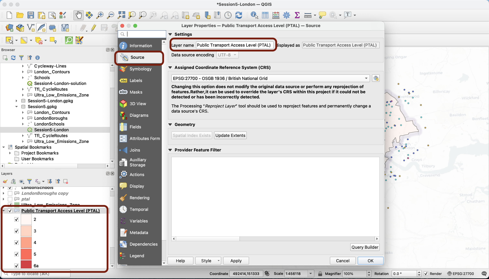
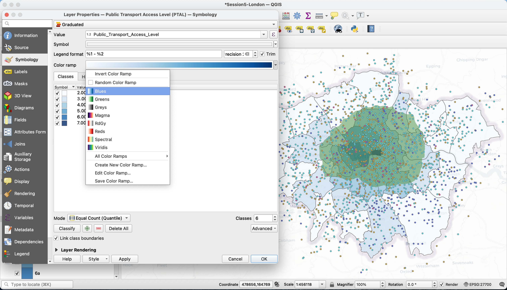

# Session 5: Choropleths & Vector geoprocessing

**Introduction to GIS  ·  Sciences Po Urban School, GETEC Masters  ·  Fall semester 2021-2022**

Lecturer: Raphaëlle Roffo

&nbsp; 

## I. Session 5 Overview

**Download the [slides](https://github.com/raphaelleroffo/intro-to-gis/raw/main/Session5/Intro%20to%20GIS%20-%20session%205.pdf)**

- *Use cases; why may you need to buffer, clip, intersect?*
- *"Crossing" multiple layers: common geoprocessing tools*
- *...*

&nbsp; 

## II. Tutorial

### Goals:

- Building a choropleth
- Defining relevant class breaks
- Running simple geoprocessing tools
- Adding map layout elements (legend, title, etc.) using the Print Layout Composer
- Exporting a map as an image, PDF or SVG vector

&nbsp; 

### Context:

This is part 2 of a tutorial in which we're exploring the theme of cycling to school (find part 1 [here](https://raphaelleroffo.github.io/intro-to-gis/intro-tutorial4.html)). 

In the context of the Covid pandemic, the question of safely getting kids to attend school has become a key element in many countries' economic recovery strategies. Taking into considerations the pressing challenges of reducing carbon emissions, walking and cycling to school represent sustainable and safe ways for children and their parents to get to school, as long as proper cycling infrastructure exists.

We are focusing on the accessibility to public transport score available in the census data. We're crossing information from the census with locations of primary schools in Greater London, and existing and planned major cycling routes. This is within the context of the GLA (Greater London Authority) plan for reducing carbon emissions, in particular with an expansion on the [Ultra Low Emission Zone](https://data.london.gov.uk/dataset/ultra_low_emissions_zone_expansion_new) since 25 October 2021. 

&nbsp; 

### Data:

We will pick up from where you left at the end of [Session 4](https://raphaelleroffo.github.io/intro-to-gis/intro-tutorial4.html); you can directly work from the project file `Session4-London-solution` inside the [Session 4 geopackage](https://github.com/raphaelleroffo/intro-to-gis/raw/main/Session4/Session4-London.gpkg). Make sure the CRS is set to `EPSG:27700` and try using a basemap of your choice from the `XYZ Tiles` section of your `Browser` panel (go back to the Session 3 tutorial for more information on how to load basemaps). I'm using `CartoDb Positron`.

Please also download the geopackage for this session [here](https://github.com/raphaelleroffo/intro-to-gis/raw/main/Session5/Session5-London.gpkg) to access a completed version of this tutorial. 

&nbsp; 

## III. Building a choropleth 

We will now focus on the London boroughs. More specifically, one field in the London Borough census data is of interest to us: **The Average Public Transport accessibility Score**. We'd like to create a choropleth in which each borough takes a colour that symbolizes the "intensity" of that score. For instance, we could pick a white to dark blue colour ramp. The darker the blue, the better the boroughs scored in terms of accessibility to public transport.

### **3.1 Changing a field's data type**

We want to apply a `Graduated symbology`. However, our accessibility score field does not appear when we try to select a value. Can you guess why?

&nbsp; 

Let's inspect our values. You can see in the attribute table that the values in this field are numeric, decimal values. However, in your `Layer Properties` window, under the `Fields` tab, you can see a little `abc` symbol in the `Id` column. This means that your field is of a data type `string` (text). Strings cannot be used to create a graduated symbology, because each value is treated like an individual category and not like a number part of a continuous variable.

&nbsp; 

We need to transform the data type of this field. More precisely, we will create a new field that takes the same values as our score but save them as decimal numbers instead of strings.

In your `Fields` tab, click on the little calculator. This opens a window that probably looks familiar to you by now! What you want to do is to create a new field. Give it a meaningful name, for instance **Transport_Accessibility**, and make sure you select `Decimal number (real)` as your Output field type. 

In the middle section, unroll the `Fields and Values` category and double click  `Average_Public_Transport_Accessibility_score,_2014`. 

&nbsp; 

Next, let's find the function that will help us convert the data type. Unroll the `Conversions` category, and find the `to_real` function whose name is pretty self-explanatory. Make sure you close the brackets after your field name so that the expression is valid. Press `OK`. 

&nbsp; 

Your new field is now available as the last field in your `Fields` tab and  in your attribute table. Notice that now the yellow pen is activated (you can see it in your layer list and at the top of your `Fields` tab). This means that you have entered the Edition mode; you are **actually altering the dataset** you're working with. This is a big difference from everything we've done so far! Now press the yellow pen and  click `Save`. The additional column you have created is now part of the source dataset - the dataset file on your computer has been permanently modified. This is why we chose to Create a new column rather than directly modifying the initial column - we wanted to make sure that we have a backup of the original column in case we made a mistake.

&nbsp; 

### **3.2 The Refactoring tool**

Note that instead of using the calculator to create a new field, you could have used the `Refactor fields` tool in the Processing toolbox. This tool allows you to create a copy of your layer, but where you have edited data types, fields names or even which fields you want to be present in the new attribute table and in which order. 

&nbsp; 

Give it a try!

&nbsp; 

### **3.3 Defining class breaks**

If you navigate back to your `Symbology` tab and select the `Graduated symbology` method, you will notice that your new field is available as a `Value`. Click `Classify` to bring up the values of that field. You can see that values range from 5.6 to 33.1

&nbsp; 

Now it's time to think about the way we're going to classify this data. Because we're working with data from an index, we will first have a look at the methodology documentation of this index. It turns out the Index is linked to an overall PTAL Public Transport Access Level Score, and we can find a conversion table on page 11 of [this document](https://www.itf-oecd.org/sites/default/files/docs/london-accessibility-indicators.pdf).

This gives us the class breaks we should use to respect the proper classification, the way it was designed to be used (1, 2.5, 5, 10, 15, 20, 25, 40). In our case, because data range from 5.6 to 33.1, we get these 5 categories:

| 5-10 | 10-15 | 15-20 | 20-25 | 25+ |

&nbsp; 

Note that if we did not have official "instructions" on how to define class breaks, we would go in the `Histogram` tab and press `Load values` to bring up a histogram of your variable's distribution. We would then examine where the mean and standard deviations are located, and look for identifiable clusters or natural breaks in this histogram

&nbsp; 

We would alternate the different methods and get back to the histogram to get a preview of which sections of the distribution get assigned which colour.

&nbsp; 

For now, let's manually edit our categories: just double click on the values and a pop-up will prompt you to enter the class bounds.

&nbsp; 

Now, you can also click on the legend items to manually edit the values. Here, beacuse the PTAL score is more widely used than the index, I will use the PTAL score.

&nbsp;

What we can do now is also rename our layer `Public Transport Access Level (PTAL)`. Navigate to the `Source` tab, change the name and click `Apply`. You can see that this has affected your layer in the `Layers` panel.

&nbsp;

### **3.3 Defining symbology**

Now go back to your `Symbology` tab. We pick a simple colour ramp that ranges from white to dark blue. Interestingly, a very strong pattern seems to emerge whereby Southwest seems to be significantly better connected than the rest of Greater London:

&nbsp; 

&nbsp; 

&nbsp; 

&nbsp; 

&nbsp; 

&nbsp; 

### **3.4 Try it out!**

Now, pick a field of your choice in the London Boroughs layer. You can drag a new copy of this layer on your canvas from your side `Browser` panel, and untick the PTAL layer in your `Layers` panel to avoid confusion. In the `Fields` tab, find a field you are interested in, and try to build a choropleth like we just did (repeat and adapt all the steps from section III). If you want to try several fields, you may want to use the `Refactor fields` tool instead of the field calculator when you convert the data type to numeric.

## IV. Geoprocessing

### **4.1 The processing toolbox**

### **4.2 Clipping**

### **4.3 Buffering**

## V. Exporting a map: setting up a layout and adding map elements (north arrow, scale bar, legend, title etc.) 

### **5.1 Introducing the Print Layout Composer**

We've established that GIS files ( `*.gqz` or geopackages) are a "recipe" to represent datasets as layers, and to display them in a specific way. Such files are _not_ images; if you want to export an image of your map (as `*.png`, `*.jpeg`, `*.pdf` or even to a printer directly), you must use the QGIS `Print Layout Composer`, which you can access from your menu `Project` > `New Print Layout...`. Give it a name such as `Session4-layout` and press Enter. 

_Note that this layout, and the changes you make to it (and save) will now be accessible from your top menu `Project` > `Layouts` > ..._

Back to your layout composer! It is for now a simple white space. Right-click on this blank space, select `Page properties…` and look at the context menu to your right. Make sure that you're working with an A4 map and the orientation is Landscape. Now we can start thinking about the elements to add to our layout. You can use the top menu `Add items`, or the corresponding icons to the left of the window. 

First we'll want to add a Map. Click the `Add Map` button. With this tool activated, you can place a map on the page. Draw a box on the blank page:

Once you release, your map appears on the page. You can move the box and edit its dimensions as much as you need. Now, let's explore how it links to your map canvas. Go back to your map canvas and switch to your other bookmark view (in my case: the `City & Canary Wharf` zoom). You can use this button to update the map on your layout to match the extent on the map canvas. You can also use the refresh button next to this one to refresh your layout when you've changed the layers that are turned on / off on your canvas. Please also note that a `Save` button is available for you to frequently save your changes to the layout.

### **5.2 Adding a legend**

### **5.3 Adding other map layout elements**

### **5.4 Exporting your map**

PNG

PDF

SVG

&nbsp; 

&nbsp; 

**Well done! This is it for this tutorial - in the final tutorial of this intro course, you will explore the link between socio-economic status and exposure to flooding in London.**

&nbsp; 

&nbsp; 

&nbsp; 

### **[Next Tutorial >](https://raphaelleroffo.github.io/intro-to-gis/intro-tutorial6.html)**
